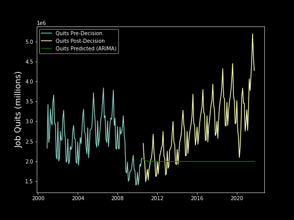

# Did LeBron James cause the great resignation?

| LeBron James | The U.S. Economy |
|--------------|------------------|
||| 

## Introduction

### NBA Player Mobility
On July 8th, 2010, the basketball world -- if not the entire world itself -- changed forever. LeBron James aired [The Decision](https://www.google.com/url?sa=t&rct=j&q=&esrc=s&source=web&cd=&cad=rja&uact=8&ved=2ahUKEwjBqcDmvZT1AhXymeAKHavKBloQFnoECAYQAQ&url=https%3A%2F%2Fen.wikipedia.org%2Fwiki%2FThe_Decision_(TV_program)&usg=AOvVaw1BAWsmOFDJEIyCIF0BRwgi) on ESPN, announcing his plans to sign with the Miami Heat and oin up with other superstars Chris Bosh and Dwyane Wade. While controversial at the time, this moment tipped the scales of power in the NBA for years to come.

One unintended result of this was the effect of increased *[player mobility](https://www.google.com/url?sa=t&rct=j&q=&esrc=s&source=web&cd=&cad=rja&uact=8&ved=2ahUKEwie0oXfvpT1AhVNmuAKHV-jAhwQFnoECAUQAQ&url=http%3A%2F%2Fwww.thebreezepaper.com%2Fsports-1%2F2019%2F3%2F12%2Fnba-and-player-mobility&usg=AOvVaw3ZV_u_lcbKbsNrWO5I_3WR)*. That is, the rising trend of NBA players signing with more favorable destinations in lieu of remaining with a smaller-market team that drafted them originally. High profile exmaples of this (Kevin Durant signing with a 73-9 Warriors team, Kawhi Leonard forcing a his way out of San Antonio, Anthony Davis forcing a trade out of New Orleans, Ben Simmons not hitting free throws, etc.) 

### The Great Resignation
In the late summer/early fall of 2021, an interesting economic/sociological trend started to emerge. Americans were quitting their jobs, a lot. This phenomena was dubbed [The Great Resignation](https://www.google.com/url?sa=t&rct=j&q=&esrc=s&source=web&cd=&cad=rja&uact=8&ved=2ahUKEwjGvZL8v5T1AhUiVd8KHbN-BAUQFnoECAYQAQ&url=https%3A%2F%2Fhbr.org%2F2021%2F09%2Fwho-is-driving-the-great-resignation&usg=AOvVaw1jXqO6RmcDmzn1kiE5YOgg) by some economists, who apparently need to prefix everything with "Great" (and I thought physicists were bad namers). This was caused by a host of factors, including, but not limited to: poor pay/working conditions, burnout, pandemic-related concerns, and others.

One aspect that has changed in terms of americans' relationship with work is their general attitude. [Over 50%](https://www.cnbc.com/2021/08/25/great-resignation-55-percent-are-looking-to-change-jobs-over-the-next-year-.html) of Americans are seeking more flexibility in a new job, with a similar percentage seeking a new job within the next year. For better or worse, "loyalty" to one's company is starting to seem [outdated in the modern workplace](https://www.bbc.com/worklife/article/20210721-why-worker-loyalty-is-at-a-breaking-point). 

The main question of this project is: *To what extent did LeBron's [The] Decision impact the increase in player mobility we've seen over the past few years in the NBA, and the rising attitube toward's a "free-agent" mentality in the general populace?* In other words, **Did LeBron James cause the '*Great Resignation*'**

## Methods
To get concreate data to back up my half-baked idea, we utilized the [Bureau of Labor Statistics (BLS) Data API Docs](https://www.bls.gov/bls/api_features.htm). This handy-dandy API gives various economic data types. We mainly focused on their ["Job Quits"](https://www.bls.gov/news.release/jolts.t04.htm) statistic to get a sense of the rate at which Americans were leaving their jobs. The rationale behind choosing Job Quits over another statistic was that just like LeBron quit on Zyldrunas Ilgauskas for greener pastures, many americans are quitting their jobs in much the same way (minus the tv crew and Steve Levy). 

We pulled monthly job quits data since the year 2000 from the BLS Data API. The results of this API call can be found in our `data` sub-directory in the csv file `job_quits_formatted.csv`. The Bureau of Labor Statistics has a handy [API Getting Started Guide](https://www.bls.gov/developers/). I'd really recommend it instead of continuing to read my garbage.

## Data
To see if *The Decision* marked any change in how americans thought about their jobs, we'll need a handy time-series:

While job quits do tend to follow seasonal patterns (see charts below), there is an uptick in the overall trend of quits post-*The Decision*. Several factors could account for this, but I'm going to pin it on LeBron because it helps my narrative. In addition, the monthly average job quits before and after LeBron's *The Decision* is plotted below:

As we can see, more americans each month quit their job on average after LeBron decided the east does not run through [Cleveland](https://youtu.be/XCSj6ezRiW0).

I know what you might be saying: "*But you can't prove that the Decision changed these numbers, just that it coincided with a shift*". In order to see if there was any causality in our time-series data, we'll need to create a model to "predict" the job quits numbers after *the Decision* based on pre-Decision data.

We generated an [ARIMA model](https://www.statsmodels.org/dev/generated/statsmodels.tsa.arima.model.ARIMA.html) using the `statstools` python library. The model is plotted below (in dark green) versus pre-Decision (light green) and post-decision (yellow) job quits. The ARIMA model should account for seasonality in our data, as job quits demonstrate this (Fig 2). 

<!-- Job Quits predixction model plot -->

Here are some model performance statistics:

| Error Type | Value |
|------------|-------|
| MAPE    | 45.1%    |
| MAE     | 1421779.6|
| RMSE    | 1702394.8|

With a 45% model accuracy, it's safe to say that a predictive model based on pre-Decision ob quits alone would not be accurate in forecasting post-Decision job quits. In other words, the increase in job quits after LeBron's *Decision* did not naturally follow the trend that was present pre-Decision.

## Conclusions

---
## Installation
The code used for this project can be downloaded via `git clone`

    https://github.com/andrewbowen19/nbaGreatResignation.git

The notebook `job_data_vis.ipynb` can be used to visualize BLS API data.

    jupyter-notebook job_data_vis.ipynb

## Useful Links
* [Bureau of Labor Statistics (BLS) Data API Docs](https://www.bls.gov/bls/api_features.htm)
* [Google Trends](https://trends.google.com/trends/explore?date=all&geo=US&q=How%20to%20change%20jobs)

## TODO

* [] Update README with process
* [] Add in more robust predictive model to time-series analysis
* [] Maybe add in a GitHub Pages-style html